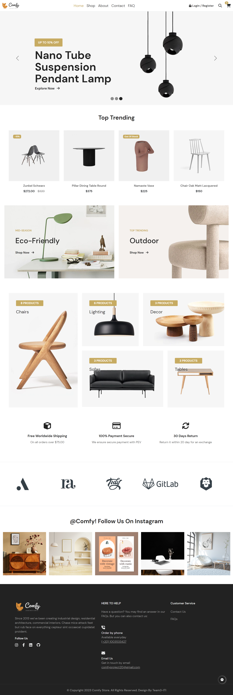

# [Comfy](https://comfy-frontend.vercel.app)
## Table of contents

- [Overview](#overview)
  - [About](#About)
  - [Screenshot](#screenshot)
  - [Links](#links)
- [Our process](#our-process)
  - [Built with](#built-with)
  - [Future work](#future-work)
- [Author](#author)

## Overview
### About

Comfy is a MERN fullstack furniture Ecommerce project that has the following features:

- Regiseteration / logging-in system
- Shopping cart
- Product details
- Checkout process
- User account
- Admin dashboard
- Search for products
- Filter products by price, categoty and brand
- Contact form

### Screenshot

### Links

- backend repo: [link](https://github.com/Comfy-team/comfy-backend)

## Our process

### Built with

- Semantic HTML5 markup
- CSS
- JavaScript
- Bootstrap
- React-Bootstrap
- React
- React-router
- Redux
- NodeJS
- Express
- MongoDB
- Mongoose
- Multer
- Font Awesome
- Apex charts
- Axios
- EmailJS
- Leaflet
- Formik
- Yup
- React-multi-carousel
- React-full-screen

### Future work

- Add a Wishlist
- Retrieve password option
- Loggin in / registering using google account

## Author

Comfy is an ITI graduation project built by a team of 4 aspiring developers:

- [Aya Mohamed](https://github.com/Aya-Saeed261)
- [Amal Halim](https://github.com/amallhalim)
- [Mariam Abdallah](https://github.com/mariam-abdallah)
- [Safaa Ibrahim](https://github.com/Safaa-Ebrahim)